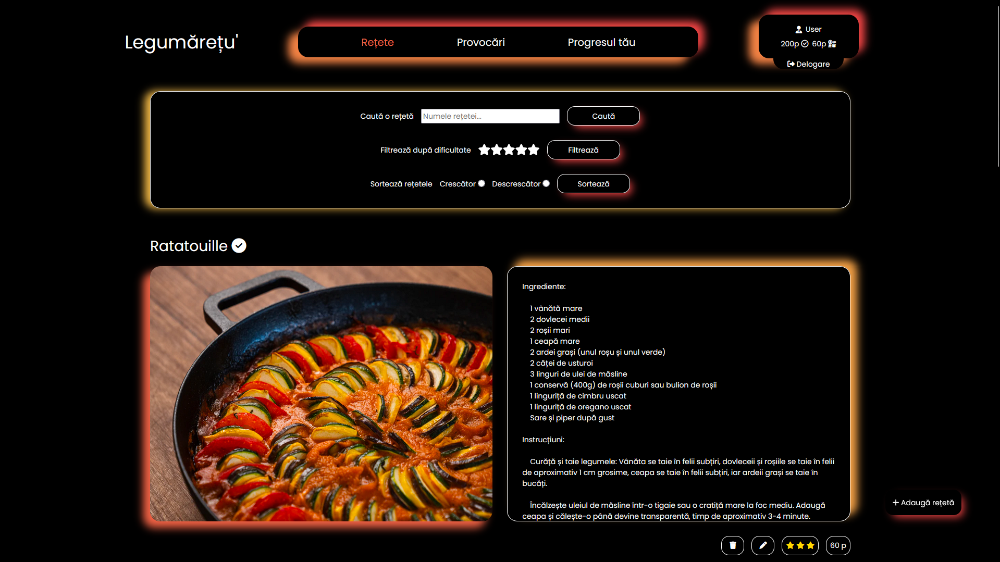
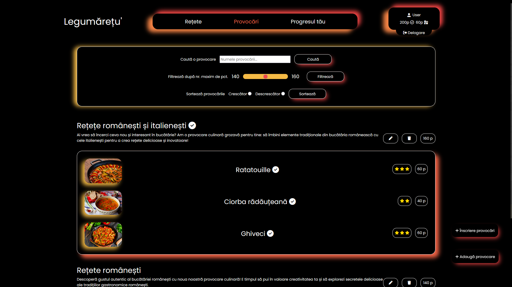
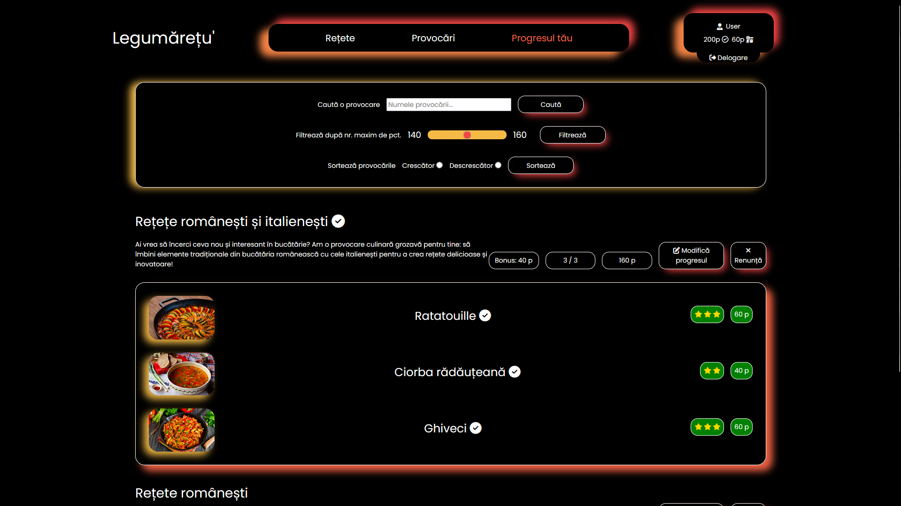

# Legumărețu'
Legumărețu' is a web app destined for people interested in expanding their culinary boundaries, using gamification techniques to attract user engagement

## Tech stack
- Backend: ASP.NET Core
- Frontend: Razor Pages
- Database: Microsoft SQL Server

## Main features
🍽️Explore a variety of cooking recipes, uploaded by moderators

✅Complete challenges based on these recipes in order to earn "official" points

🍳Submit your own recipes and challenges, and complete them for "personal" points

## Setup
Run the following command in the Package Manager Console (PMC):

`Update-Database`

A superuser with the administrator role will be created on startup: email `admin@email.com`, password `P@ssw0rd`